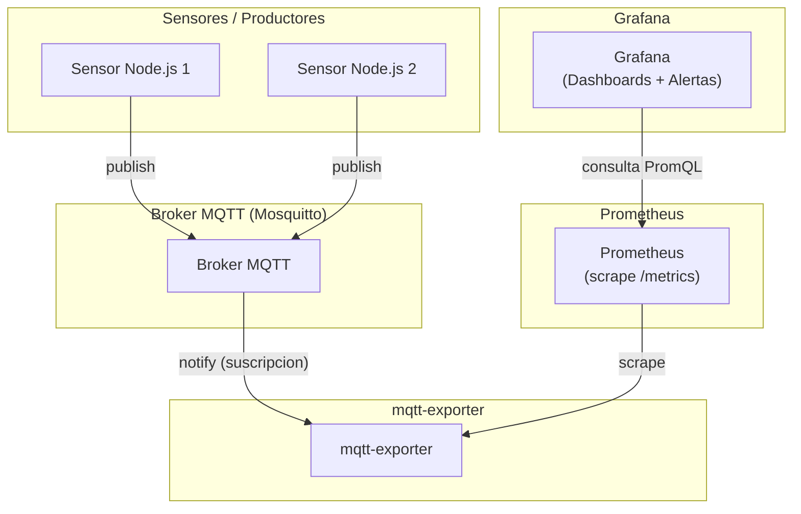

## 🧠 Arquitectura Técnica – Flujo de Datos MQTT → Prometheus → Grafana

Este documento describe el comportamiento de cada componente del sistema y su rol en la comunicación. Además, incluye representaciones visuales en lenguaje Mermaid para clarificar el flujo.

---

### 🔁 Flujo General de Comunicación

---

### ⚙️ Comportamiento por componente

#### 🟢 Node.js (Sensores)

* **Activo**: Publica datos MQTT periódicamente
* No espera respuesta, solo emite

#### 🟣 Mosquitto (Broker)

* **Pasivo**: Reenvía mensajes a quien esté suscrito
* No almacena a largo plazo (a menos que uses `retain` o `persistence`)
* No interpreta los datos

#### 🔵 mqtt-exporter

* **Activo frente a MQTT**: se suscribe a topics y actualiza su estado
* **Pasivo frente a Prometheus**: expone `/metrics`, espera scraping

#### 🟠 Prometheus

* **Activo**: Scrapea a intervalos configurados
* No mantiene conexión abierta, solo extrae

#### 🟡 Grafana

* **Pasivo**: Consulta Prometheus bajo demanda
* Refleja visualmente los datos y activa alertas

---

### 🧭 Direcciones de comunicación

| Desde      | Hacia         | Tipo | Método             |
| ---------- | ------------- | ---- | ------------------ |
| Node.js    | Mosquitto     | Push | `mqtt.publish()`   |
| Mosquitto  | mqtt-exporter | Push | `mqtt.subscribe()` |
| Prometheus | mqtt-exporter | Pull | HTTP `/metrics`    |
| Grafana    | Prometheus    | Pull | PromQL             |

---

### 📌 Conclusiones

* El **mqtt-exporter es reactivo**: no interroga al broker, simplemente escucha
* Mosquitto actúa como **middleware pasivo** y eficiente
* Prometheus **centraliza la recogida** mediante scrapes periódicos
* Grafana se limita a **visualizar lo que Prometheus ha recogido**

---

### 📦 ¿Por qué no eliminar Mosquitto?

* Se perdería el desacoplamiento entre productores y consumidores
* Los sensores tendrían que conocer el formato Prometheus
* No habría suscripción múltiple ni escalabilidad

---

Este diseño modular permite añadir más sensores, exportadores o canales de notificación sin romper la arquitectura base.
