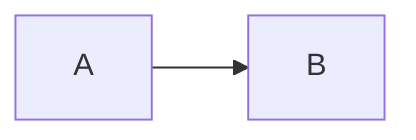
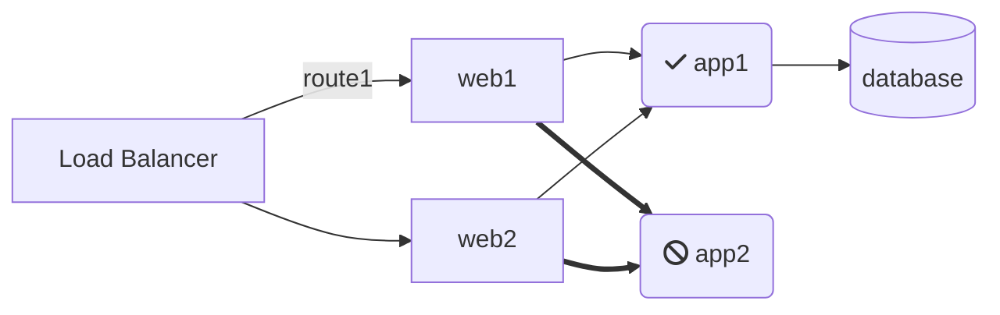

## 💬 ¿Qué es este plugin?

**Grafana Diagram Panel** es un plugin de panel para Grafana que permite crear:

* Diagramas de flujo (flow charts)
* Diagramas de secuencia (sequence diagrams)
* Diagramas de Gantt

Todo esto usando la sintaxis de **[Mermaid.js](https://mermaid-js.github.io/)**, una biblioteca que convierte texto en gráficos dinámicos y visualmente atractivos.

---

## ⚙️ Funcionalidades clave

* Los diagramas se definen con sintaxis Mermaid, que es parecida a Markdown.
* Las **series de métricas** de Grafana se usan para **colorear** los nodos del diagrama (texto o fondo).
* Se asocia una métrica con un nodo si el nombre de la métrica (alias) **coincide con el ID del nodo** en el diagrama.
* Es posible usar **composites** para agrupar varias métricas en un solo nodo, aplicando umbrales personalizados.

> ⚠️ Nota: Los caracteres especiales en los alias se reemplazan por guiones bajos `_`.

---

## 🚀 Inicio rápido

### Ejemplo básico de Mermaid



Esto genera un diagrama simple de flujo con dos nodos y una flecha de A a B.

Si tienes dos métricas con alias `A-series` y `B-series`, puedes hacer que cada nodo refleje el estado de esas métricas.

---

## 🔡 Reemplazo automático de caracteres

Los siguientes caracteres se reemplazan automáticamente por `_`:

```
" , ; = : { }
```

Puedes definir reemplazos adicionales en la pestaña **Display**, usando expresiones regulares o caracteres individuales.

---

## 📊 Ejemplos visuales

### 1. Subgráficos (`subgraph`)

Agrupa nodos bajo un título común.


---

### 2. Diagramas personalizados con íconos



> Esto permite definir nodos con íconos FontAwesome y estructuras realistas (balanceador, apps, bases de datos).

---

### 3. Opciones de campo (Field Options)

Permiten configurar:

* Umbrales
* Agregación (min, max, avg, last…)
* Formatos de unidad
* Decimales
* Mapas de valores a texto
* Colores de fondo o texto
* Overrides de estilo CSS

---

### 4. Overrides de campo

Puedes sobrescribir opciones por métrica específica (field override), lo cual es útil cuando varias métricas comparten el mismo nodo.

---

### 5. Personalización de tema y estilos CSS

Puedes adaptar el estilo a:

* Tema oscuro o claro de Grafana
* Tu propio CSS personalizado
* Interacciones visuales según valores

---

### 6. Uso de variables

Puedes usar variables de Grafana (`$var`) dentro del diagrama.


---

### 7. Indicadores como color de fondo

Muestra visualmente el estado de un nodo usando color de fondo.

---

## 📦 Opciones adicionales del plugin

* Mostrar colores según **umbral**
* Mapear **valores numéricos a texto** (ej. `0 => OK`, `1 => ERROR`)
* Personalización visual por CSS
* Mostrar valor como color de **fondo** o de **texto**
* Definiciones temáticas
* Soporte para **composites**
* Uso de **variables** de Grafana dentro del grafo

---

## 🔁 Composites (agregado de métricas)

Permite representar el estado de **varias métricas** en un solo nodo. Se evalúan los **umbrales individuales** y se muestra el peor estado.

Ejemplo:

```plaintext
Alias "A-series" y "B-series" → Compuesto "xyz"
```

Se mostrará:

* Verde si ambas están bien
* Amarillo si alguna está en advertencia
* Rojo si alguna está en error


---

## 🔤 Mapeo de valor a texto

Convierte valores numéricos en texto comprensible.

Ejemplo:

```
0 → "OK"
1 → "Advertencia"
2 → "Error"
```

Se refleja en el nodo del diagrama.


---


