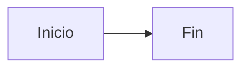
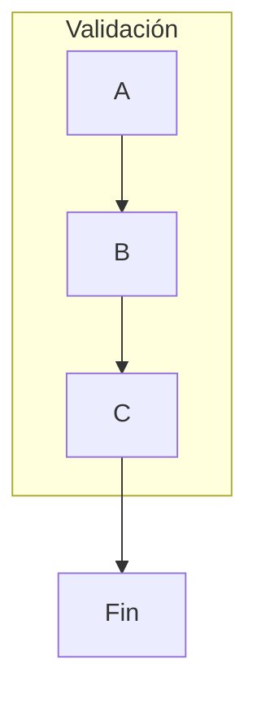

# 📘 Apuntes del Alumno – Sesión 1: Diagram Panel y Mermaid en Grafana

---

## 🎯 Objetivos de la sesión

* Comprender qué es Diagram Panel y para qué se utiliza.
* Aprender la sintaxis básica de Mermaid.
* Representar procesos de negocio simples sin usar fuentes de datos.
* Familiarizarse con el entorno visual de Grafana y las opciones del plugin.

---

## 🧩 ¿Qué es Diagram Panel?

* Un **plugin de visualización** para Grafana.
* Permite crear **diagramas de flujo, decisiones y jerarquías**.
* Usa sintaxis **Mermaid**, que se escribe como texto.
* No necesita datos reales: se puede usar de forma totalmente estática.

---

## ✍️ Sintaxis básica de Mermaid



* `graph LR`: define dirección Left → Right (otras: `TD`, `RL`, `BT`).
* `A --> B`: flecha de conexión entre nodos.
* `A[Texto]`: nodo rectangular.
* `((Texto))`: nodo circular.
* `{Texto}`: nodo de decisión (rombo).

---

## 🧱 Tipos de nodo y formas

| Sintaxis    | Forma             |
| ----------- | ----------------- |
| `[Texto]`   | Rectángulo        |
| `((Texto))` | Círculo           |
| `{Texto}`   | Rombos (decisión) |
| `[(Texto)]` | Cilindro          |

---

## 🔄 Direcciones posibles

* `TD`: Top Down (arriba → abajo)
* `LR`: Left to Right (izquierda → derecha)
* `BT`: Bottom to Top (abajo → arriba)
* `RL`: Right to Left (derecha → izquierda)

Prueba cómo cambia el flujo cambiando estas letras en `graph ...`

---

## 📦 Agrupaciones con `subgraph`



* Sirve para representar **etapas, departamentos o bloques lógicos**.
* El título del `subgraph` se muestra como etiqueta del grupo.

---

## 💬 Flechas con texto y condiciones

```mermaid
A --> B
B -- OK --> C
B -- NOK --> D
D -.-> A
```

* `-- Texto -->`: añade etiquetas a las flechas.
* `-.->`: flecha punteada (flujo alternativo o reintento).

---

## 🎨 Estilos visuales

* Puedes cambiar el estilo desde el panel (Dark, Light, Classic).
* Activa "Use shape background for metric indicator" para ver colores.
* Usa saltos de línea: `<br>` para separar líneas dentro de un nodo.

---

## 🔠 Iconos con FontAwesome

```mermaid
A(fa:fa-check Aprobado)
```

* Puedes usar íconos: `fa:fa-ban`, `fa:fa-cogs`, `fa:fa-truck`, etc.
* Útil para representar estados visualmente con semántica.

---

## 📌 Variables

```mermaid
A["Estado: ${estado}"] --> B
```

* `${estado}` es una **variable del dashboard**.
* Te permite adaptar el contenido de un nodo según lo que seleccione el usuario.

---

## 🧠 Consejos rápidos

* Empieza simple: 2-3 nodos, sin datos.
* Cambia las direcciones para ver qué disposición se adapta mejor.
* Usa subgraphs para agrupar tareas o fases.
* Las etiquetas en las flechas son muy útiles en flujos condicionales.

---

## 🏁 Hoy trabajamos por fases

1. Crear tu primer panel con Mermaid (`Inicio → Fin`)
2. Probar formas (`[ ]`, `(( ))`, `{ }`)
3. Agrupar nodos con `subgraph`
4. Aplicar estilos, colores, saltos de línea
5. Etiquetar flechas, condicionar flujos
6. Usar iconos (`fa:`) y variables `${}` (opcional)

---

## 💬 Preguntas para pensar

* ¿Qué procesos reales de tu empresa podrías representar?
* ¿Qué tipo de nodos y flechas usarías para mostrar errores, decisiones o rutas alternativas?
* ¿Prefieres flujos horizontales o verticales para entender un proceso?

---

Usa esta hoja como guía rápida durante la sesión o como resumen personal.
