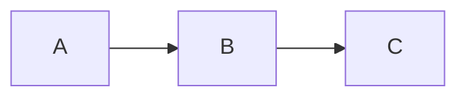
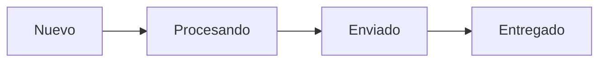

## 📘 Guía rápida de sintaxis Mermaid para Diagram Panel en Grafana

Esta referencia te permitirá construir diagramas efectivos con sintaxis Mermaid dentro del plugin Diagram Panel. Aplica tanto para representaciones simples como para estructuras más complejas.

---

### 🔹 Estructura básica



* `graph LR` define la dirección del flujo (Left to Right).
* Usa `TD` para Top-Down o `RL` para Right to Left.
* `A --> B` representa una transición de nodo A a nodo B.

---

### 🔹 Tipos de conexiones

```mermaid
A --> B     // línea normal
A --- B     // línea discontinua
A -.-> B    // línea punteada
A ==> B     // flecha con doble cabeza (requiere soporte del plugin)
```

---

### 🔹 Etiquetas en flechas

```mermaid
A -->|texto| B
```

* Muestra `texto` encima de la flecha entre A y B.

---

### 🔹 Definir nodos con forma y texto

```mermaid
A[Inicio]         // cuadro rectangular
B(Ruta intermedia) // nodo redondeado
C{Decisión}        // rombo para decisiones
```

---

### 🔹 Subgrupos (subgraphs)

```mermaid
subgraph Etapa 1
  A --> B
end

subgraph Etapa 2
  C --> D
end
A --> C
```

* Permite agrupar nodos por fases del proceso.

---

### 🔹 Colores y estilos (solo si lo permite el plugin)

Si Diagram Panel permite `classDef` o estilos inline:

```mermaid
classDef verde fill:#c2f0c2,stroke:#2d862d;
class B verde
```

* Define una clase `verde` con color de fondo y borde.
* Asigna la clase a un nodo: `class B verde`

⚠️ *No todos los estilos están soportados por Diagram Panel. Verifica visualmente.*

---

### 🔹 Enlaces a URLs

```mermaid
click A "https://ejemplo.com" _blank
```

* Hace clicable el nodo `A` hacia una URL externa.

---

### 🔹 Comentarios

```mermaid
%% Esto es un comentario
```

---

### 🧪 Ejemplo completo



---

Para probar sintaxis Mermaid fuera de Grafana puedes usar: [https://mermaid.live](https://mermaid.live)

Esta guía resume los elementos más usados para representar procesos de negocio en Diagram Panel. Puedes combinar nodos, estilos y subgraphs para crear visualizaciones claras y profesionales.
