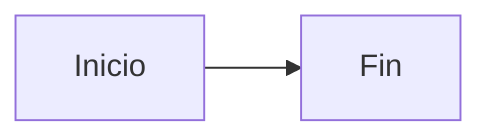

### Fase 1.1 – Crear un panel básico con Diagram Panel

🎯 **Objetivo**
Crear un primer panel en Grafana usando el plugin Diagram Panel, sin usar ninguna fuente de datos. Familiarizarse con el entorno de edición y con la sintaxis Mermaid básica.

🗂️ **Scaffolding**
No se requiere estructura de archivos. El trabajo se realiza íntegramente desde la interfaz de Grafana.

🪜 **Pasos guiados**

1. Accede a Grafana desde tu entorno ([http://localhost:3000](http://localhost:3000)) e inicia sesión con:

   * Usuario: `admin`
   * Contraseña: `admin`

2. Ve a:

   * Dashboards → New → Add new panel

3. Cambia la visualización a **Diagram Panel**.

4. Deja vacía la sección de consultas (no se usará ninguna métrica).

5. En el campo **Diagram definition**, pega este contenido:

6. Observa cómo se representa el flujo de izquierda a derecha con dos nodos y una flecha.

✅ **Validaciones**

* El panel se renderiza correctamente sin errores.
* Aparecen dos nodos: "Inicio" y "Fin".
* La flecha entre ambos refleja una relación de flujo.
* No hay datos vinculados ni métricas activas.

🎯 **Retos**

* Cambiar `LR` por `TD` o `RL` y observar el cambio en la dirección del diagrama.
* Sustituir los nombres de los nodos por otros más representativos de un proceso real.

💬 **Reflexión**

* ¿Qué ventajas aporta un flujo visual simple frente a una tabla de estados?
* ¿Cómo ayuda esta representación a pensar mejor en los pasos de un proceso?
