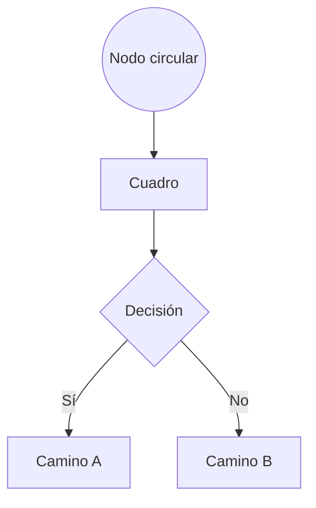

### Fase 1.2 – Probar formas y conexiones Mermaid

🎯 **Objetivo**
Aprender a utilizar las distintas formas de nodos disponibles en Mermaid y los diferentes tipos de conexiones entre ellos, observando cómo cambia la representación visual del flujo.

🗂️ **Scaffolding**
No se requiere estructura de archivos. Todo se trabaja en el editor de Diagram Panel en Grafana.

🪜 **Pasos guiados**

1. Abre el panel creado en la fase anterior o crea uno nuevo siguiendo los mismos pasos iniciales.

2. Sustituye el contenido del campo **Diagram definition** por:



3. Observa los distintos tipos de nodo:

   * `((Texto))` crea un círculo.
   * `[Texto]` crea un rectángulo.
   * `{Texto}` crea un rombo (decisión).

4. Cambia la dirección del grafo probando `TD`, `LR`, `RL`, `BT`.

   * Ejemplo:

   ```mermaid
   graph LR
     A --> B
     B --> C
   ```

✅ **Validaciones**

* Se renderizan correctamente al menos tres tipos distintos de forma.
* Se observan las diferencias entre las direcciones `TD`, `LR`, `RL`, `BT`.
* Las conexiones con texto (como "Sí" y "No") se visualizan como etiquetas sobre las flechas.

🎯 **Retos**

* Representa un mini proceso real de decisión, por ejemplo: "¿Pedido válido?" con rutas para aceptar o rechazar.
* Usa flechas punteadas (`-.->`) para representar flujos alternativos o excepciones.

💬 **Reflexión**

* ¿Qué forma se adapta mejor a decisiones, tareas o resultados?
* ¿Cómo cambia la comprensión del flujo al cambiar la dirección del grafo?
