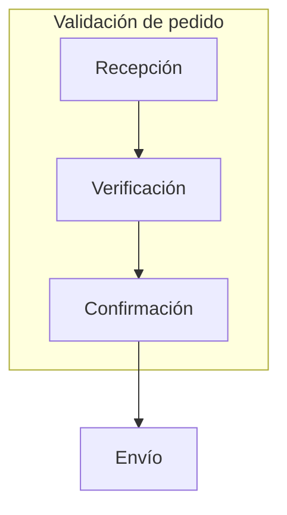

### Fase 1.3 – Subgraphs para agrupar procesos

🎯 **Objetivo**
Aprender a organizar visualmente partes de un proceso dentro de subgraphs para representar fases, departamentos o agrupaciones lógicas en un flujo de negocio.

🗂️ **Scaffolding**
No se requiere estructura de archivos. Se trabaja en el editor de Diagram Panel.

🪜 **Pasos guiados**

1. Abre un panel nuevo o reutiliza el anterior.

2. Sustituye el contenido del campo **Diagram definition** por:

3. Observa cómo se agrupan los nodos A, B y C dentro de un contorno visual con etiqueta "Validación de pedido".

4. Cambia el título del subgraph por otro representativo, como "Control de calidad" o "Etapa logística".

5. Añade otro subgraph con su propio flujo si quieres representar fases paralelas.

✅ **Validaciones**

* El subgraph tiene borde visible y título.
* Los nodos internos se conectan entre sí.
* Al menos un nodo conecta con otro fuera del subgraph.

🎯 **Retos**

* Crea un segundo subgraph que represente una fase distinta del proceso (ej. "Postventa").
* Añade conexiones entre subgraphs.

💬 **Reflexión**

* ¿Qué ventajas aporta agrupar nodos visualmente?
* ¿Qué criterio usarías en tu empresa para dividir los subgraphs: etapas, equipos, roles...?
