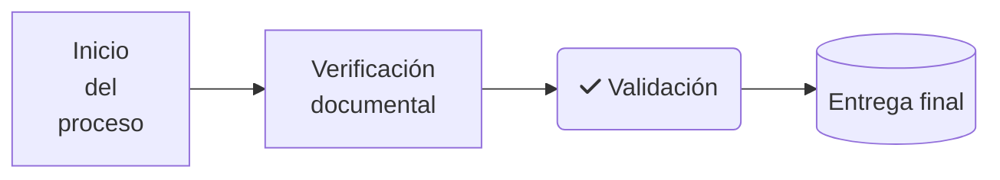

### Fase 1.4 – Aplicar estilos visuales y etiquetas enriquecidas

🎯 **Objetivo**
Aprender a mejorar la legibilidad de los diagramas aplicando estilos visuales, cambios de tema y etiquetas enriquecidas con saltos de línea o iconografía.

🗂️ **Scaffolding**
No se requiere estructura de archivos. Se trabaja íntegramente en Diagram Panel.

🪜 **Pasos guiados**

1. Abre el panel creado en fases anteriores o uno nuevo.

2. Sustituye el contenido por:

3. En el panel de opciones del plugin:

   * Activa `Use shape background for metric indicator` (aunque no haya datos)
   * Cambia el estilo visual entre:

     * `Style Common: Dark`
     * `Style FlowChart: Light`
     * `Style FlowChart: Classic`

4. Observa cómo cambia la representación gráfica y cómo se adaptan los saltos de línea (` `).

5. Cambia la forma del nodo D a `((Entrega final))` para convertirlo en círculo.

✅ **Validaciones**

* Se ha probado al menos un estilo de tema distinto.
* Al menos un nodo usa saltos de línea.
* Al menos un nodo contiene un ícono con prefijo `fa:`.

🎯 **Retos**

* Añadir un nodo con el ícono `fa-ban` para representar una condición de error.
* Usar `style` en texto si el plugin lo permite en la versión activa.

💬 **Reflexión**

* ¿Cómo influye el estilo visual en la comprensión del flujo?
* ¿Cuál de los estilos te parece más legible para un usuario no técnico?
