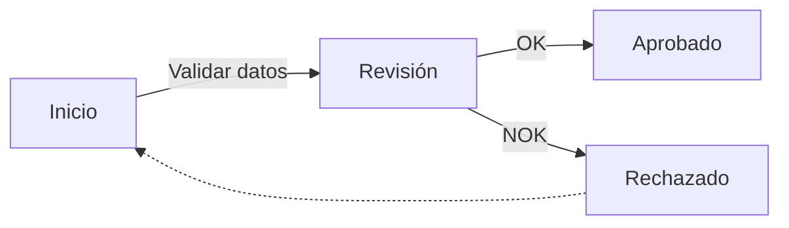

### Fase 1.5 – Añadir texto en flechas y rutas condicionales

🎯 **Objetivo**
Utilizar comentarios sobre flechas, conexiones condicionales y flujos alternativos para enriquecer la expresividad del diagrama y modelar decisiones reales dentro del proceso.

🗂️ **Scaffolding**
No se necesita estructura de archivos. Todo se define desde la interfaz de edición de Diagram Panel.

🪜 **Pasos guiados**

1. Crea o edita un panel Diagram ya existente.

2. Sustituye el contenido del diagrama por:

3. Analiza las conexiones:

   * `-- texto -->` añade comentarios sobre la flecha.
   * `-.->` crea una línea punteada (flujo alternativo o de excepción).

4. Prueba a cambiar `LR` por `TD` para visualizarlo en vertical.

✅ **Validaciones**

* Hay al menos dos flechas con texto explicativo.
* Se ha usado una flecha punteada.
* El flujo muestra una decisión con al menos dos salidas.

🎯 **Retos**

* Añadir un nodo adicional que represente una segunda revisión tras el rechazo.
* Añadir un flujo cíclico con comentario del tipo "Reintento".

💬 **Reflexión**

* ¿En qué casos reales usarías flechas punteadas?
* ¿Qué ventaja aporta mostrar texto directamente en las transiciones?
