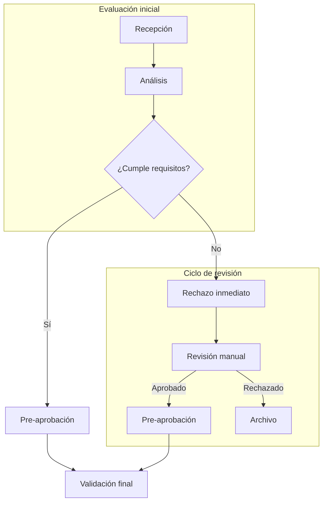

### Fase 1.6 – Subgraphs condicionales y múltiples rutas

🎯 **Objetivo**
Aprender a combinar subgraphs con rutas condicionales para representar decisiones complejas, bifurcaciones de proceso y agrupaciones jerárquicas de flujo.

🗂️ **Scaffolding**
No se necesita estructura de archivos. Todo se define dentro del campo Mermaid del Diagram Panel.

🪜 **Pasos guiados**

1. Crea un nuevo panel o edita uno existente.

2. Sustituye el contenido con:

3. Observa cómo:

   * Se combinan subgraphs.
   * Se representan rutas condicionales dentro y fuera de subgraphs.
   * Se conecta un nodo externo (`D`) y uno interno (`G`) hacia un mismo destino (`I`).

✅ **Validaciones**

* Hay al menos dos subgraphs diferenciados.
* Cada subgraph contiene nodos con lógica propia.
* Hay al menos una condición que genera múltiples rutas.
* Todos los nodos están correctamente conectados.

🎯 **Retos**

* Añadir un subgraph adicional llamado "Auditoría" con una ruta que intercepte el flujo antes de "Validación final".
* Añadir una línea punteada de "Archivo" hacia "Recepción" para representar un reingreso excepcional.

💬 **Reflexión**

* ¿Qué procesos reales podrían modelarse con múltiples subgraphs condicionales?
* ¿Cuándo conviene dividir el flujo en bloques frente a mantenerlo lineal?
