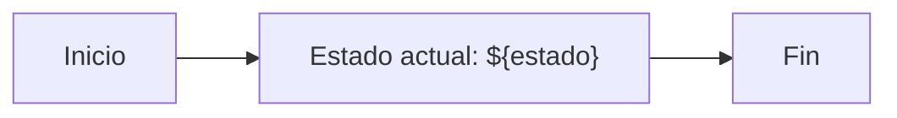

### Fase 1.7 – Uso de variables de Grafana en Diagram Panel

🎯 **Objetivo**
Aprender a utilizar variables de Grafana dentro de definiciones Mermaid para que el contenido de los nodos se adapte dinámicamente según selecciones realizadas por el usuario.

🗂️ **Scaffolding**
Variables definidas en el dashboard de Grafana:

* Tipo: **Constant** o **Custom**
* Nombre: `estado`
* Valor: `En revisión`

🪜 **Pasos guiados**

1. Abre tu dashboard y ve a: **Dashboard settings → Variables → New**

2. Crea una variable:

   * **Name**: `estado`
   * **Type**: `Constant`
   * **Value**: `En revisión`

3. Guarda los cambios.

4. En tu panel Diagram, define el Mermaid con uso de variable:

5. Observa cómo el contenido del nodo B incluye dinámicamente el valor de la variable.

✅ **Validaciones**

* El nodo B muestra "Estado actual: En revisión"
* Cambiar el valor de la variable modifica el texto en tiempo real

🎯 **Retos**

* Cambiar el tipo de variable a **Custom** con múltiples valores (`En revisión`, `Validado`, `Rechazado`) y probar el selector.
* Usar dos variables distintas en distintos nodos del diagrama.

💬 **Reflexión**

* ¿Cómo podrías usar esta técnica para personalizar dashboards por usuario, rol o idioma?
* ¿Qué tipo de información crítica se beneficiaría de este tipo de interpolación visual?
