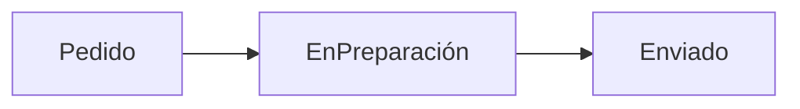

## 2. Fundamentos del plugin Diagram Panel

🎯 **Qué es**:
El plugin **Diagram Panel** permite crear gráficos de flujo directamente dentro de Grafana utilizando la sintaxis **MermaidJS**. Está pensado para representar visualmente procesos de negocio, flujos de trabajo, etapas de producción o cualquier lógica condicional o jerárquica.

---

### 🧩 ¿Qué lo hace diferente?

* Permite **dibujar nodos y relaciones** de forma declarativa con texto Mermaid.
* Soporta **datos dinámicos**: si un nodo se llama como una columna (`Field`) de los datos, Grafana lo rellena con el valor.
* Se puede extender visualmente con:

  * Mermaid `classDef` para definir colores y estilos básicos.
  * **CSS inyectado** para personalización avanzada.

---

### 📘 Sintaxis Mermaid soportada

El panel Diagram permite Mermaid en su variante `graph`, especialmente en modos:

* `graph LR` (de izquierda a derecha)
* `graph TD` (de arriba a abajo)

Ejemplo mínimo:

---

### 🔗 ¿Cómo se vinculan los datos?

* Si la serie de datos tiene una columna llamada `Pedido`, y existe un nodo `Pedido` en el Mermaid, el valor se inyecta automáticamente en el nodo.
* Se puede personalizar el número de decimales, unidad o el formato visual desde **Value mappings**, **Overrides** o con estilos Mermaid.

---

### 🧠 Ideas clave para el alumno

* La **clave de vinculación** es el nombre del nodo (no el label visual).
* Los datos se inyectan al final de la cadena de renderizado Mermaid, por lo tanto:

  * primero se dibuja el nodo (estructura)
  * luego Grafana le inserta el valor dinámico
* Si el nodo no tiene matching con ningún campo, **no mostrará dato**.