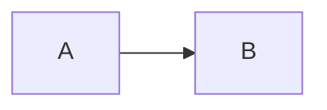
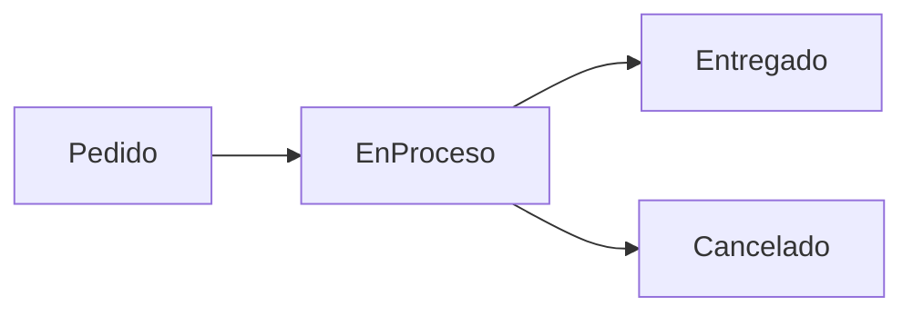
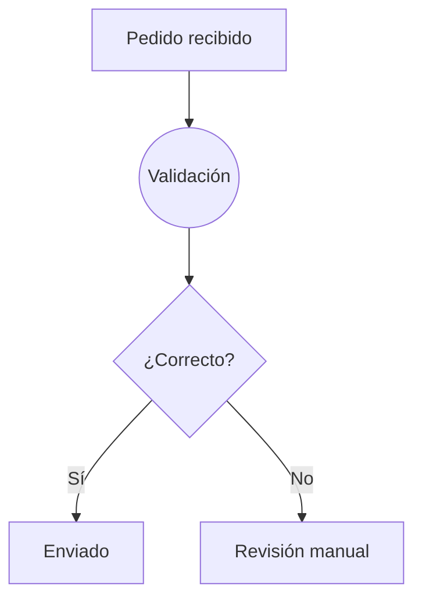
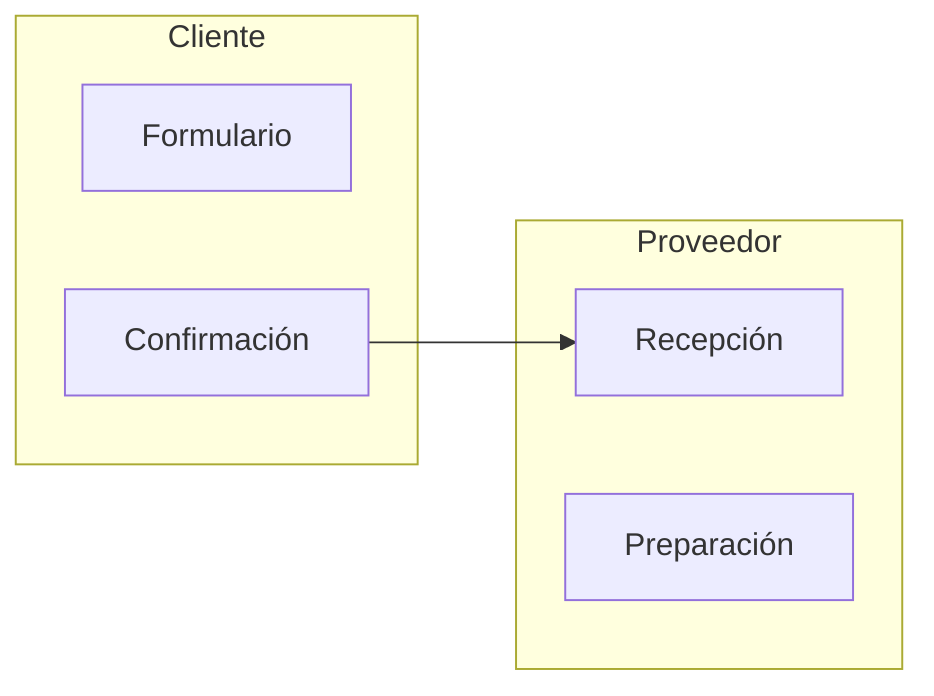

## 3. Sintaxis Mermaid básica

🎯 **Objetivo**: Entender la estructura básica de Mermaid para construir flujos de negocio visuales, antes de aplicar datos o estilos.

---

### 🧱 Declaración de un grafo

* `graph LR` indica que el grafo se dibuja **Left to Right** (de izquierda a derecha).
* También puedes usar:

  * `graph TD`: Top Down (arriba a abajo)
  * `graph RL`: Right to Left
  * `graph BT`: Bottom to Top

---

### 🔗 Conectores

* `-->`: flecha recta
* `-.->`: flecha discontinua
* `==>`: flecha de tipo “acción” o énfasis (no todos los temas lo soportan)

---

### 🔠 Nombres y alias

* `[Texto]`: nodo rectangular
* `((Texto))`: nodo circular
* `{Texto}`: nodo de decisión
* `-->|etiqueta|`: flechas con condición o descripción

---

### 👥 Subgráficos

* Los `subgraph` ayudan a organizar visualmente los roles o etapas.

---

### 🧪 Práctica recomendada

Comenzar con un grafo estático simple, y luego sustituir los nodos clave (`Pedido`, `Validación`, etc.) por nombres de campos de tus datos para que se vinculen dinámicamente más adelante.