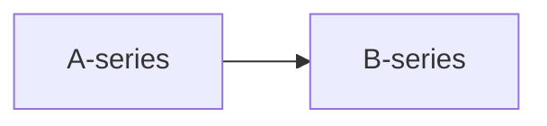

# Clase: Visualización con Diagram Panel en Grafana - Enfoque en Estilos

## 🔹 Objetivo de la clase

Aprender a utilizar el plugin **Diagram Panel** en Grafana con MermaidJS, con foco en la **personalización visual avanzada mediante CSS** y estilos en cascada. Se hará una breve introducción sobre la ingesta de datos, pero el énfasis estará en la presentación visual y las buenas prácticas de diseño.

---

## 1. Breve demo: generación de datos

* Fuente de datos: `grafana-testdata-datasource`, modo `Random Walk`.
* Crear dos series: `A-series` y `B-series`.
* Aplicar transformaciones:

  * `Reduce` con función `Max` para obtener el valor máximo en los últimos 10 minutos.
* Etiquetar las métricas para facilitar su enlace con nodos Mermaid.

---

## 2. Fundamentos del plugin Diagram Panel

* Representa procesos o flujos con sintaxis **MermaidJS**.
* Compatible con bindings dinámicos (vinculación de datos por nombre de nodo).
* Permite personalización avanzada con estilos Mermaid (`classDef`) y CSS directo.

---

## 3. Sintaxis Mermaid básica



* El nombre del nodo debe coincidir con el valor del campo en la columna `Field` del panel de datos.

---

## 4. Diseño visual con Mermaid (`classDef`)

```mermaid
graph LR
  A-series:::entrada --> B-series:::salida

  classDef entrada fill=#001f3f,stroke=#fff,color=#fff;
  classDef salida fill=#fff,stroke=#001f3f,color=#001f3f;
```

* Permite declarar estilos para clases de nodos.
* Limitado a atributos básicos (fill, stroke, color).
* No permite `!important` ni selectores avanzados.

---

## 5. Personalización visual avanzada con CSS (Grafana > Advanced > Custom CSS)

```css
#diagram-1 g.entrada span {
  fill: green !important;
  color: green !important;
}

#diagram-1 g.salida rect {
  stroke: crimson !important;
  stroke-width: 3px !important;
}
```

* Usa selectores SVG para apuntar a nodos concretos.
* Requiere inspeccionar el DOM del panel (`F12`) para obtener las clases reales generadas.
* La cascada importa: usar `#diagram-1` ayuda a superar estilos embebidos por defecto.

---

## 6. Buenas prácticas de diseño visual

* Jerarquía visual clara (colores, grosores, tipografía).
* Disposición lógica de nodos (izq ➞ der, agrupaciones, separadores).
* Consistencia en nombres y estilos.
* Usar Mermaid para lo estructural, CSS para lo visual.

---

## 7. Laboratorio guiado

🎯 Objetivo: Refactorizar un diagrama existente para aplicar buenas prácticas visuales.

### 🪜 Pasos guiados

1. Crear un panel Diagram con 2 nodos (A-series, B-series).
2. Mostrar el valor máximo con `Reduce`.
3. Aplicar estilos `classDef` para distinguir roles (entrada/salida).
4. Refinar estilos visuales con CSS (`Advanced > Custom CSS`).
5. Verificar en el inspector (`F12`) qué selectores se están aplicando.
6. Añadir `tooltip` y atributos decorativos.

### ✅ Validaciones

* Los nodos deben tener estilos claramente diferenciados.
* El borde, color de fondo y texto deben seguir el diseño propuesto.
* Al cambiar los valores de entrada, el estilo se mantiene.

---

## 8. Recursos útiles

* [MermaidJS](https://mermaid.js.org/) - Documentación oficial.
* [Diagram Panel Plugin](https://grafana.com/grafana/plugins/jdbranham-diagram-panel/) - Página del plugin.
* [Cheatsheet Mermaid](https://mermaid.js.org/syntax/classDiagram.html) - Sintaxis de `classDef`.
* Documentación de estilos CSS y selectores SVG en navegadores.

---

📌 Esta sesión forma parte del curso "Visualización de Flujos de Negocio en Grafana" y se centra en **estilos visuales y diseño de flujos expresivos**.
