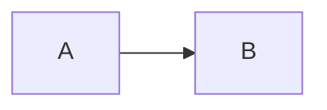

### Fase 2.1 – Crear panel Diagram Panel en blanco

🎯 **Objetivo**
Iniciar el laboratorio creando un panel vacío con el plugin **Diagram Panel**, que servirá de base para aplicar estilos y enlazar datos en las siguientes fases.

🗂️ **Scaffolding**
No requiere archivos previos. Se trabaja desde Grafana con el datasource de prueba incluido.

🪜 **Pasos guiados**

1. Abre Grafana en tu entorno de Codespaces ([http://localhost:3000](http://localhost:3000) o el puerto que corresponda).
2. En el menú lateral, haz clic en **+ Create > Dashboard**.
3. Haz clic en **Add new panel**.
4. En la sección **Visualization**, selecciona el plugin **Diagram**.
5. Cambia el título del panel (arriba del todo) por ejemplo a: `Flujo básico`.
6. Asegúrate de que el datasource sea `-- Mixed --` o `grafana-testdata-datasource`.
7. En el campo **Diagram definition**, introduce un contenido mínimo:

8. Haz clic en **Apply** para guardar el panel dentro del dashboard.

✅ **Validaciones**

* Se visualiza un diagrama con dos nodos conectados (`A → B`).
* El tipo de panel activo es `Diagram` (no `Mermaid`, no `Text`, etc.).
* El panel se puede editar y el campo **Diagram definition** está accesible.

🎯 **Retos**

* Cambia los nombres de los nodos por otros significativos como `Inicio` y `Fin`.
* Intenta cambiar la dirección a `TD` (top-down) o `BT` (bottom-top) y observa el resultado.

💬 **Reflexión**

* ¿Qué ventajas ofrece Diagram Panel frente a otros como `Text` o `SVG`?
* ¿Qué sentido tiene trabajar con un panel vacío al principio?