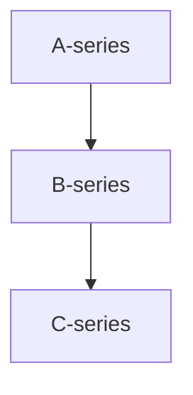

### Fase 2.4 – Añadir tercer bloque al panel

🎯 **Objetivo**
Ampliar el diagrama con un nuevo nodo (`C-series`) conectado visualmente y asociado a una nueva métrica de datos, reforzando la estructura jerárquica del flujo.

🗂️ **Scaffolding**
Continuación del panel ya creado en las fases anteriores. Añadir nuevo nodo y métrica a los elementos existentes.

🪜 **Pasos guiados**

1. En la sección **Query**, añade una tercera métrica desde `TestData DB`:

   * Usa también `Random Walk` y nómbrala como `C-series`.

2. Asegúrate de que la transformación **Reduce** también la incluye:

   * Ve a **Transform → Reduce**.
   * Marca `C-series` como campo incluido.
   * Verifica que las tres métricas (`A-series`, `B-series`, `C-series`) aparecen con sus valores máximos.

3. Edita el contenido Mermaid del panel Diagram:



4. (Opcional) Añade clases visuales para cada uno:

```mermaid
  class A-series entrada;
  class B-series transito;
  class C-series salida;

  classDef entrada fill=#e6f7ff,color=#007acc,stroke=#007acc;
  classDef transito fill=#fff3cd,color=#856404,stroke=#856404;
  classDef salida fill=#ffe6e6,color=#cc0000,stroke=#cc0000;
```

✅ **Validaciones**

* El panel muestra tres nodos enlazados: A ➝ B ➝ C.
* Los valores de cada nodo son visibles y actualizables.
* El estilo `classDef` se aplica correctamente a los tres nodos.

🎯 **Retos**

* Añade un cuarto nodo `D-series` con una conexión alternativa desde `A-series`.
* Usa otro estilo visual (verde, gris...) para representar una ruta especial.

💬 **Reflexión**

* ¿Qué patrón visual ayuda más a identificar flujos críticos o alternativos?
* ¿Dónde usarías una ruta secundaria (e.g., errores, excepciones, reintentos)?