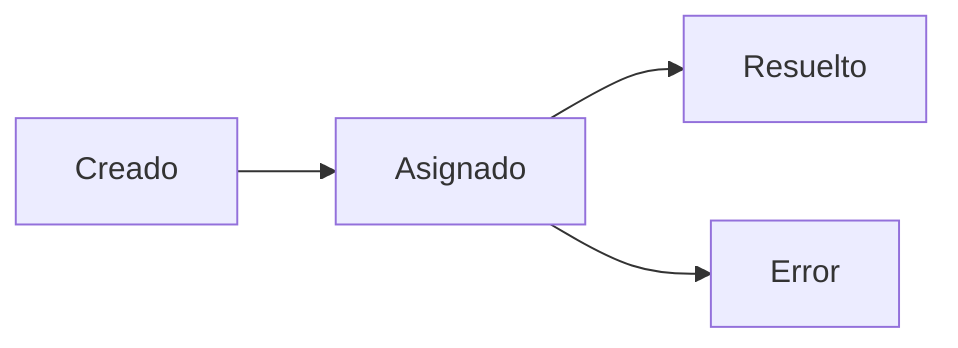

## 🔹 Fase 1 – Visualizar el flujo temporal de eventos desde base de datos SQL

---

### 🎯 Objetivo

Usar la tabla `eventos` (que ya contiene miles de registros con `timestamp`) para construir una visualización dinámica en `Diagram Panel`. El objetivo es reflejar **cómo evolucionan los eventos de negocio en el tiempo**, coloreando nodos del diagrama en función de la actividad registrada recientemente.

---

### ⚠️ Importante: Limitación del plugin `Diagram Panel`

El plugin `marcusolsson-diagram-panel` **solo interpreta datos dinámicos si provienen de una serie temporal** (es decir, datos con una columna `time`), y si el campo `value` es numérico.
Consultas que hacen `COUNT()` agrupando por texto —aunque tengan `timestamp` en el `WHERE`— **no se consideran series temporales**, y por tanto **no se aplican colores automáticamente a los nodos**.

---

### 🗂️ Estructura

* Tabla: `eventos`
* Columnas clave: `timestamp`, `tipo_evento`, `proceso_id`
* Nodos representados: `creado`, `asignado`, `resuelto`, `error`
* Visualización con Diagram Panel basada en eventos temporales reales

---

### 🪜 Pasos guiados

#### 1. ❌ Consulta no válida para Diagram Panel dinámico (solo modo tabla)

```sql
SELECT
  tipo_evento AS metric,
  COUNT(*) AS value
FROM eventos
WHERE $__timeFilter(timestamp)
GROUP BY tipo_evento;
```

Esta consulta muestra el número de eventos por tipo en el rango, **pero no genera una serie temporal** compatible con Diagram Panel. **Los nodos no se colorearán dinámicamente.**

---

#### 2. ✅ Reconducción: usar series temporales reales

Cambia la consulta a:

```sql
SELECT
  timestamp AS time,
  tipo_evento AS metric,
  1 AS value
FROM eventos
WHERE $__timeFilter(timestamp);
```

Esto genera una serie temporal:

* Una por cada tipo de evento.
* Con `value = 1` en cada instante en que ocurrió.
* **Compatible con Diagram Panel dinámico**.

---

#### 3. Crea el diagrama Mermaid básico



> Los IDs de los nodos (`creado`, `asignado`, etc.) **deben coincidir exactamente con los valores de `metric`** que devuelve la consulta.

---

#### 4. Define los thresholds para colorear nodos

En el panel, ve a:

* **Thresholds**
* Añade:

  * `[1]` → Verde
  * `[5]` → Amarillo
  * `[10]` → Rojo

---

#### 5. Explora el resultado

* Cambia el rango temporal del dashboard: `Last 5 minutes`, `Last 1 hour`, etc.
* Verás cómo los nodos se colorean automáticamente si hay eventos de ese tipo en el rango.

---

### 🎯 Retos

1. 📈 **Acumular eventos por minuto (Time Series)**

   ```sql
   SELECT
     date_trunc('minute', timestamp) AS time,
     tipo_evento AS metric,
     COUNT(*) AS value
   FROM eventos
   WHERE $__timeFilter(timestamp)
   GROUP BY time, tipo_evento
   ORDER BY time;
   ```

   Puedes usar esto en un panel `Time Series` como complemento al diagrama.

2. 🧪 **Click para ir a detalle por tipo de evento**

   ```mermaid
   click error "d/alertas?var-evento=error" "Ver errores"
   ```

3. 🚦 **Personalizar severidad visual con nombre del evento**

   Si `error` es crítico y `resuelto` es buen estado, ajusta colores en los thresholds o nodo a nodo.

---

### ✅ Validaciones

* ✅ El panel usa `timestamp` como `time`.
* ✅ El campo `value` es numérico (1).
* ✅ Los nombres de `metric` coinciden con los nodos Mermaid.
* ✅ El coloreado es automático y se actualiza con el rango temporal.

---

### 💬 Reflexión

Este paso enseña un principio esencial en Grafana: **si trabajas con Diagram Panel y necesitas datos dinámicos, deben ser series temporales reales**. No basta con hacer `GROUP BY` sobre valores si no produces una columna `time`.

Este patrón se puede reutilizar para representar alarmas, procesos, flujos o cualquier sistema con eventos cronológicos. Puedes combinarlo con paneles `Stat`, `Time Series` o `Table` para enriquecer el contexto.

