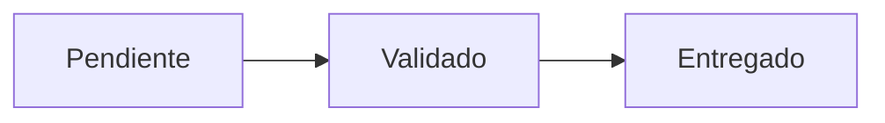

## 🔹 Fase 5 – Enlazar nodos con navegación contextual (drilldown)

---

### 🎯 Objetivo

Permitir al usuario navegar desde el diagrama principal hacia dashboards de detalle filtrados por estado o por identificador. Aunque Diagram Panel **no soporta enlaces dinámicos desde la query**, sí permite definir enlaces *estáticos* desde el texto Mermaid mediante `click`.

---

### 🧠 ¿Qué permite esta fase?

* Crear una experiencia tipo **overview → detalle**
* Usar variables de Grafana para filtrar datos en dashboards enlazados
* Simular comportamiento de navegación SCADA o CRM visual

---

### 🪜 Pasos guiados

#### 1. Crea un segundo dashboard de detalle

* Añade un panel tipo **Table** para mostrar los tickets.
* Usa una variable `var-estado` en el dashboard (tipo: `custom`, valores: `Pendiente`, `Validado`, `Entregado`).
* Filtra el panel usando:

```sql
SELECT * FROM tickets
WHERE estado = '${var-estado}'
AND $__timeFilter(fecha_actualizacion);
```

> Tip: Activa "Include All" si quieres permitir ver todos los estados.

#### 2. Vuelve al dashboard principal (el del flujo)

En el panel Diagram, añade los enlaces de navegación:



> Tip: Asegúrate de que el dashboard destino se llama literalmente `detalle` o ajusta la URL según tu ruta real.

#### 3. Prueba la navegación

* Haz clic sobre un nodo del flujo
* Comprueba que llegas al dashboard con la variable aplicada automáticamente
* Valida que la tabla muestra resultados filtrados

---

### 🔁 Retos

1. 🔄 **Simula un flujo más complejo con múltiples nodos navegables**

   > Tip: Puedes usar nodos como `Asignado`, `Escalado`, `En espera`, cada uno con su propio dashboard de detalle.

2. 🧪 **Agrega enlaces condicionales (simulados)**

   > Tip: Aunque no es dinámico, puedes colocar un nodo adicional de tipo `"Detalle"` con `click` apuntando a un dashboard por ID (ejemplo: `var-id=1234`).

3. 🗺️ **Crea una red de dashboards interconectados**

   > Tip: Usa dashboards `detalle_cliente`, `detalle_estado`, `detalle_prioridad`, todos enlazados desde Diagram.

4. 🧩 **Fusiona parámetros del dashboard con los de la URL**

   > Tip: Puedes pasar múltiples variables:

   ```mermaid
   click VAL "d/detalle?var-estado=Validado&var-prioridad=Alta" "Ver validados alta"
   ```

---

### ✅ Validaciones

* ✅ Los nodos contienen enlaces funcionales.
* ✅ Al hacer clic, se abre el dashboard de detalle filtrado.
* ✅ Las variables de URL se transmiten correctamente (`var-estado`, `var-id`…).
* ✅ La experiencia de navegación es coherente.

---

### 💬 Reflexión

Aunque Diagram Panel no permite enlaces dinámicos basados en valores reales, el uso de `click` en Mermaid permite construir una interfaz navegable sencilla pero muy potente. En entornos productivos, esto se usa para facilitar accesos rápidos a contextos de detalle: cliente, incidente, máquina, pedido…
