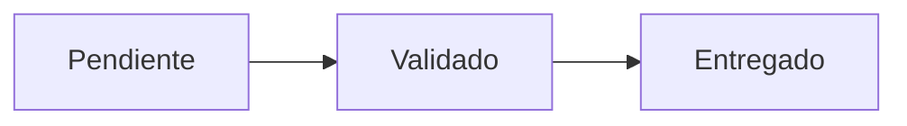

## 🔹 Fase 7 – Dashboard completo con flujo + KPIs SQL

---

### 🎯 Objetivo

Montar un dashboard integrado que combine:

* Diagrama de flujo con Diagram Panel
* Paneles de KPIs (Stat, Gauge)
* Tabla de detalle
* Filtros dinámicos por cliente, estado y rango temporal

Este dashboard permite una visión **end-to-end** de tickets o procesos con navegación, filtros y visualización clara del estado actual.

---

### 🧩 Estructura del dashboard

1. 🔷 Diagram Panel (flujo Mermaid)
2. 🔢 Stat Panel: tickets creados hoy
3. 🧭 Bar Gauge: tickets por prioridad
4. 🧾 Table Panel: lista de tickets recientes
5. 🎛️ Variables: cliente, estado y rango temporal

---

### 🪜 Pasos guiados

#### 1. Define variables del dashboard

* **cliente**: tipo `query`, consulta:

  ```sql
  SELECT DISTINCT cliente FROM tickets ORDER BY cliente;
  ```

* **estado**: tipo `query`, consulta:

  ```sql
  SELECT DISTINCT estado FROM tickets ORDER BY estado;
  ```

* **prioridad** *(opcional)*: tipo `query`, consulta:

  ```sql
  SELECT DISTINCT prioridad FROM tickets;
  ```

> Tip: Marca `Include All` para cada una si deseas una opción sin filtrar.

---

#### 2. Configura Diagram Panel (flujo visual)



> Aunque no hay mapeo dinámico de colores, puedes forzar colores fijos con `classDef`.

---

#### 3. Panel Stat – Tickets abiertos hoy

```sql
SELECT COUNT(*) AS value
FROM tickets
WHERE fecha_creacion >= CURRENT_DATE
AND (${var-cliente} = 'All' OR cliente = '${var-cliente}');
```

#### 4. Panel Bar Gauge – Por prioridad

```sql
SELECT prioridad AS metric, COUNT(*) AS value
FROM tickets
WHERE $__timeFilter(fecha_actualizacion)
AND (${var-cliente} = 'All' OR cliente = '${var-cliente}')
GROUP BY prioridad;
```

#### 5. Panel Table – Detalle

```sql
SELECT id, cliente, estado, prioridad, fecha_actualizacion
FROM tickets
WHERE estado = '${var-estado}'
AND (${var-cliente} = 'All' OR cliente = '${var-cliente}')
AND $__timeFilter(fecha_actualizacion)
ORDER BY fecha_actualizacion DESC;
```

---

### 🔁 Retos

1. 🧪 **Duplica el dashboard y cambia el enfoque**

   > Tip: Haz una versión alternativa centrada en prioridad (`Alta → Media → Baja`) y no en estado.

2. 🧭 **Usa diferentes periodos para comparación**

   > Tip: Añade paneles que comparen tickets creados hoy vs ayer.

3. 🔍 **Añade filtros invisibles usando `$__interval`**

   > Tip: Úsalo para agrupar automáticamente por hora o día según el rango seleccionado.

4. 🧠 **Activa panel links entre KPIs y tablas**

   > Tip: Usa la opción “Drilldown” en los paneles para enlazar con dashboards filtrados automáticamente.

---

### ✅ Validaciones

* ✅ Todos los paneles responden al cambio de variables.
* ✅ La tabla y métricas están sincronizadas.
* ✅ El flujo Mermaid sirve como mapa de navegación.
* ✅ El dashboard se puede duplicar y adaptar fácilmente.

---

### 💬 Reflexión

Con esta fase se alcanza un dashboard profesional, útil y modular. Aunque Diagram Panel tiene limitaciones, al combinarlo con variables, tablas y KPIs, se consigue un entorno visual **centrado en el negocio**, no en métricas de infraestructura. Este patrón puede escalarse para múltiples dominios: soporte, producción, operaciones, etc.